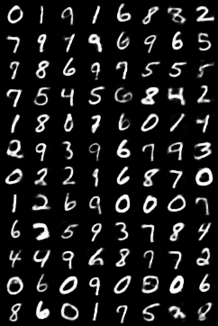

# Example of replacing MLP with KAN in autoencoder(AE) and variational autoencoder(VAE)
This is an implementation that uses KAN instead of MLP in both autoencoder and variational autoencoder, 
the experimental dataset is MNIST, and the same network architecture and training parameters are constructed on CPU. 
After experimentation, it is observed that KAN achieves the same results as MLP in both autoencoder and variational autoencoder,
but the training time is much longer, for 5 epochs on CPU, the training time for variational autoencoder using MLP is 192 seconds, 
while the training time for variational autoencoder using KAN is 1117 seconds.            
              
这是一个在自动编码器和变分自动编码器中使用 KAN 代替 MLP 的实现，实验数据集为 MNIST，在 CPU 上构建了相同的网络结构和训练参数。
实验结果表明，KAN 在自动编码器和变异自动编码器中都取得了与 MLP 相同的结果，但训练时间要长得多，在 CPU 上训练 5 个 epoch，
使用 MLP 的变异自动编码器的训练时间为 192 秒，而使用 KAN 的变异自动编码器的训练时间为 1117 秒。

## 生成图片
### VAE_MLP

### VAE_KAN

